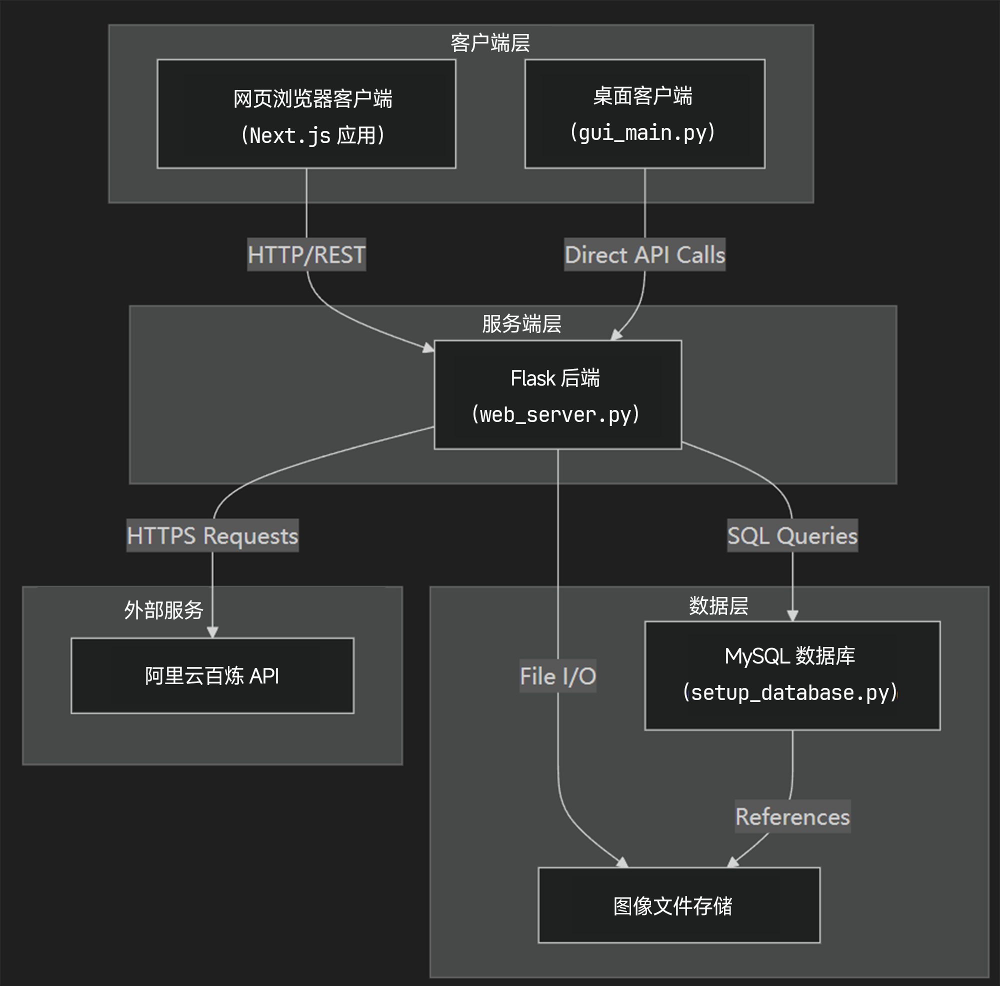
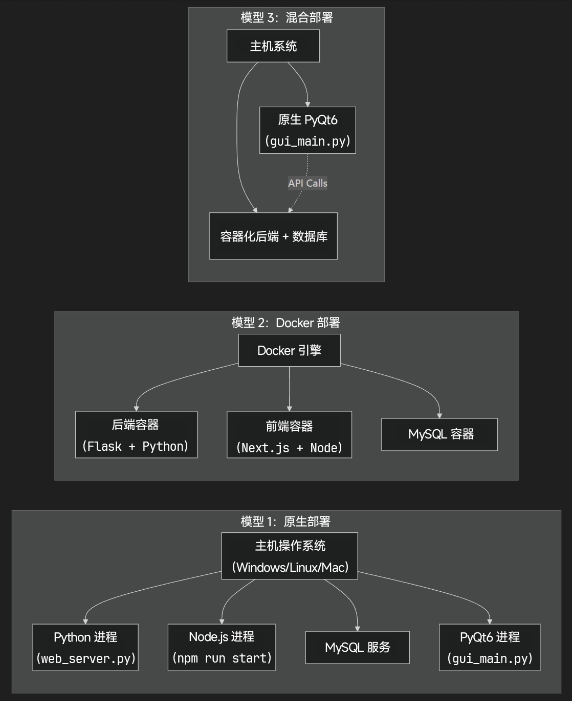
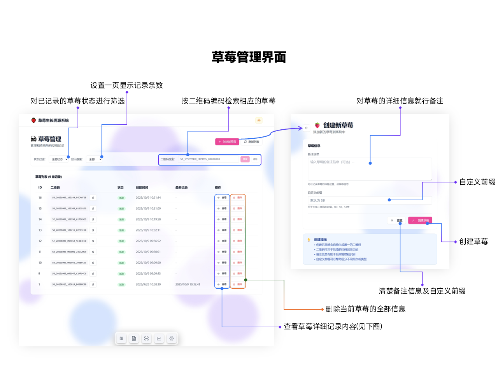
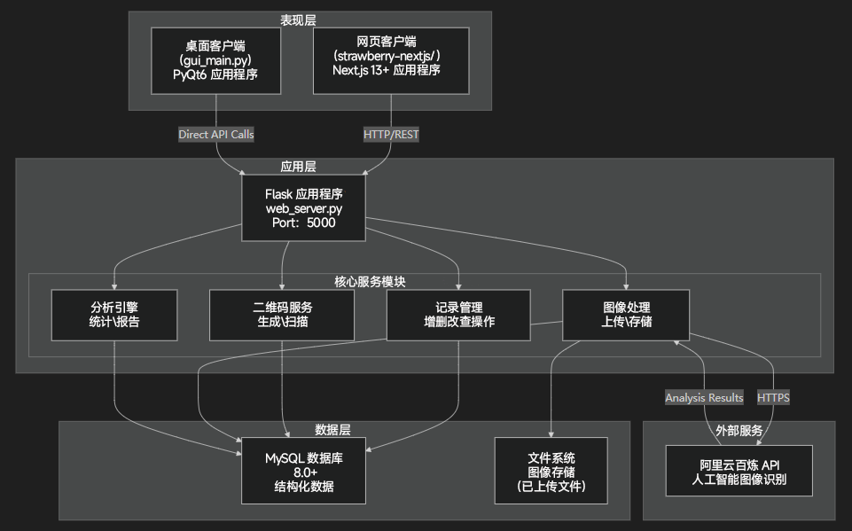
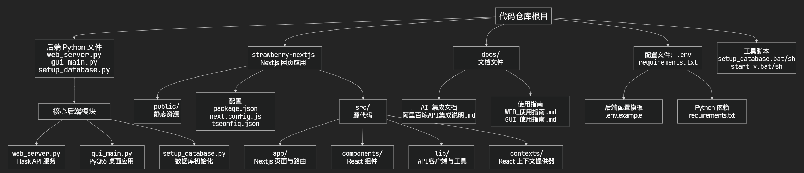

#### 一、概述

##### Ⅰ.目的和范围

本文档对草莓生长溯源系统（草莓生长溯源系统）进行了高层次的介绍，这是一个跟踪和管理草莓种植记录的多平台农业管理应用程序。该系统通过二维码技术、图像文档和人工智能分析实现完全可追溯性。

本概述涵盖：

- 系统用途和主要用例
- 体系结构组件及其关系
- 技术栈和关键代码模块
- 核心功能能力
- 部署模型

##### Ⅱ.系统用途

草莓生长追溯系统旨在将草莓种植记录数字化和集中化，使农业经营能够：

- 跟踪从种植到收获的生长阶段
- 将可视化文档与特定草莓批次相关联
- 生成唯一的二维码以实现产品可追溯性
- 使用 AI 驱动的图像识别分析增长模式
- 生成统计报告和趋势分析
- 通过 Web 和桌面界面访问数据

该系统为草莓种植者、分销商和质量控制人员提供完整的记录管理解决方案。

##### Ⅲ.系统组件

代码库由四个主要部署组件和一个外部集成组成：

| 部分          | 技术             | 入口点               | 用途                                |
| :------------ | :--------------- | :------------------- | :---------------------------------- |
| 后端 API 服务 | Flask（Python）  | `web_server.py`      | REST API 服务器、业务逻辑、数据访问 |
| 网页前端      | Next.js（React） | `strawberry-nextjs/` | 基于浏览器的用户界面                |
| 数据库        | MySQL 8.0+       | `setup_database.py`  | 持久化数据存储                      |
| 人工智能服务  | 阿里云百炼 API   | 外部 HTTPS           | 图像识别与分析                      |

**组织架构图：**



##### Ⅳ.技术栈

该系统建立在现代 Python 和 JavaScript 堆栈之上，具有以下核心技术：

**后端技术:**

| 技术         | 版本   | 主要文件            | 用途         |
| :----------- | :----- | :------------------ | :----------- |
| Python       | 3.8+   | `.py`               | 核心后端语言 |
| Flask        | 最新版 | `web_server.py`     | Web API 框架 |
| MySQL 连接器 | 最新版 | `setup_database.py` | 数据库驱动   |
| Python venv  | 内置   | `.venv/`            | 虚拟环境隔离 |

**前端技术：**

| 技术    | 版本   | 位置                 | 用途              |
| :------ | :----- | :------------------- | :---------------- |
| Node.js | 18+    | `strawberry-nextjs/` | JavaScript 运行时 |
| Next.js | 13+    | `strawberry-nextjs/` | React 框架        |
| React   | 最新版 | `strawberry-nextjs/` | UI 组件库         |
| npm     | 最新版 | `package.json`       | 包管理器          |

**基础技术：**

| 技术   | 版本 | 配置        | 用途         |
| ------ | ---- | ----------- | ------------ |
| MySQL  | 8.0+ | **`.env`**  | 关系型数据库 |
| Docker | 可选 | Docker 文件 | 容器化       |

##### Ⅴ.核心能力

该系统实施了六个主要功能领域：

###### 1. 记录管理

- 草莓生长记录的创建、读取、更新、删除 （CRUD）作
- 田间追踪：品种、种植日期、地点、生长阶段、注意事项
- 记录版本控制和历史记录
- 批处理作支持

###### 2. 二维码系统

- 为每条草莓记录生成唯一的二维码
- 通过网络摄像头界面扫描二维码
- 解码二维码数据以检索关联记录
- 将二维码链接到产品批次以实现可追溯性

###### 3. 图像管理

- 上传和存储与生长记录相关的图像
- 每条记录支持多张图像
- 带有缩略图预览的图像库
- 按记录 ID 组织文件

###### 4. 分析和报告

- 增长数据的统计分析
- 跨时间段的趋势可视化
- 以各种格式导出报告
- 包含关键指标的仪表板

###### 5. AI图像识别

- 与阿里云百炼 API 集成
- 用于植物健康评估的自动图像分析
- 用于生长阶段识别的模式识别
- 草莓图像中的异常检测

###### 6. 主题管理

- 浅色模式和深色模式支持
- 用户偏好持久性
- 跨界面的一致主题

##### Ⅵ.配置和环境

系统对后端和前端组件都使用基于环境的配置：

###### 后端配置

配置文件：（从**`.env`、`.env.example`**)

关键配置领域：

- 数据库连接参数（主机、端口、用户名、密码、数据库名称）
- Flask 服务器设置（主机、端口、调试模式）
- 图像上传的文件存储路径
- 阿里云百炼 API 凭证和端点
- 日志记录级别和输出目标

###### 前端配置

配置文件：（从**`strawberry-nextjs/.env.local`、`.env.example`**)

关键配置领域：

- 后端 API 基本 URL
- Next.js服务器端口
- 公共资产路径
- 环境模式（开发/生产）

##### Ⅶ.部署模型

系统支持多种部署策略，以适应不同的作需求

**部署模型比较**



##### Ⅷ.本机部署

- 直接安装在主机作系统上
- 通过 和 手动管理依赖关系**`requirements.txt`、`package.json`**
- 通过 **`web_server.py`、`npm run start`**
- 适用于开发和单服务器部署

**Docker 部署**

- 可移植性的容器化服务
- 自动依赖关系解析
- 简化的扩展和复制
- 适用于生产和云部署


##### Ⅸ.文件结构概述

代码库中的关键文件和目录：

**根目录**

| 文件 / 目录         | 用途                     |
| ------------------- | ------------------------ |
| `web_server.py`     | Flask 后端 API 入口点    |
| `setup_database.py` | 数据库模式初始化脚本     |
| `requirements.txt`  | Python 依赖项说明        |
| `.env.example`      | 后端配置模板             |
| `.env`              | 后端配置（用户创建）     |

**前端目录**

| 文件 / 目录                      | 用途                       |
| -------------------------------- | -------------------------- |
| `strawberry-nextjs/`             | Next.js 前端应用程序根目录 |
| `strawberry-nextjs/package.json` | Node.js 依赖项             |
| `strawberry-nextjs/.env.example` | 前端配置模板               |
| `strawberry-nextjs/.env.local`   | 前端配置（用户创建）       |

##### Ⅹ.启动程序

系统需要多个组件的顺序启动：

**后端启动**

```
# Activate virtual environment
.\\.venv\\Scripts\\activate  # Windows
source .venv/bin/activate  # Linux/Mac

# Start Flask backend
python web_server.py
```

后端必须先启动，前端或桌面客户端才能运行，因为它提供了 API 层。

**前端启动**

```
cd strawberry-nextjs
npm run start    # Production mode
npm run dev      # Development mode with hot-reload
```

---

#### 二、系统界面介绍

##### Ⅰ.主页(仪表盘界面)


##### Ⅱ.草莓管理界面




##### Ⅲ.扫码记录界面


##### Ⅳ.统计报告界面

显示数据库内所有有效数据的统计报告


##### Ⅴ.系统设置界面


---

#### 三、系统架构

##### Ⅰ.目的和范围

本文档介绍了草莓生长溯源系统的高级架构，解释了前端接口、后端服务、数据库和外部集成如何作为多层应用程序协同工作。本页提供了组件职责、通信模式和部署拓扑的体系结构概述。

**多层架构**

**架构层:**



**组件通信架构**;


##### Ⅱ.配置架构

系统使用基于环境的配置，后端和前端组件具有单独的文件。

**配置结构：**

| 组件       | 配置文件            | 位置               | 用途                             |
| ---------- | ------------------- | ------------------ | -------------------------------- |
| 后端服务   | `.env`              | 项目根目录         | 数据库凭证、Flask 配置、API 密钥 |
| 前端网页   | `.env.local`        | strawberry-nextjs/ | API 端点 URL、前端专属配置       |
| 数据库设置 | `setup_database.py` | 项目根目录         | 数据库初始化与模式创建           |
| 示例模板   | `.env.example`      | 上述两个位置       | 配置文件模板                     |

##### Ⅲ.技术堆栈和依赖关系

**后端技术栈**

| 技术            | 版本   | 组件          | 用途                       |
| --------------- | ------ | ------------- | -------------------------- |
| Python          | 3.8+   | 运行时        | 后端语言及运行时环境       |
| Flask           | 最新版 | web_server.py | Web 框架与 REST API 服务器 |
| MySQL Connector | 最新版 | 数据库驱动    | MySQL 数据库连接           |
| Python dotenv   | 最新版 | 配置          | 环境变量管理               |
| QR Code Library | 最新版 | 二维码生成    | 二维码创建功能             |

**前端技术栈**

| 技术                  | 版本   | 位置                 | 用途                   |
| --------------------- | ------ | -------------------- | ---------------------- |
| Node.js               | 18+    | 运行时               | JavaScript 运行时环境  |
| Next.js               | 13+    | `strawberry-nextjs/` | React 框架与服务端渲染 |
| React                 | 18+    | UI 框架              | 基于组件的用户界面     |
| TypeScript/JavaScript | 最新版 | 开发语言             | 前端编程语言           |

**数据库与存储**

| 组件     | 版本   | 用途                             |
| -------- | ------ | -------------------------------- |
| MySQL    | 8.0+   | 记录、元数据的主要数据存储       |
| 文件系统 | 不适用 | 在 uploads/ 目录中存储图像和文件 |

**外部服务**

| 服务           | 用途                         | 集成点                     |
| -------------- | ---------------------------- | -------------------------- |
| 阿里云百炼 API | 基于人工智能的图像识别与分析 | web_server.py 图像处理路由 |

##### Ⅳ.服务通信模式

**请求-响应模式**

所有客户端应用程序（Web）都通过同步 HTTP REST API 调用与后端通信：

1. **客户端→后端**：带有JSON有效负载的HTTP请求
2. **后端→数据库/存储**：查询或文件作
3. **后端→外部 API**（如有需要）：向百炼API发出HTTPS请求
4. **后端→客户端**：带有JSON数据的HTTP响应

**API 端点分类**

后端公开按功能领域组织的 RESTful 端点：

| 端点前缀       | 用途                           | 数据库交互             |
| -------------- | ------------------------------ | ---------------------- |
| `/api/records` | 草莓记录的增删改查（CRUD）操作 | `records` 表           |
| `/api/images`  | 图像上传、检索、人工智能分析   | `images` 表 + 文件系统 |
| `/api/qr`      | 二维码生成与扫描               | `records` 表           |
| `/api/stats`   | 统计与分析                     | 跨表聚合查询           |

##### Ⅴ.安全与访问控制

**配置安全**

- 数据库凭证存储在文件中（不提交到代码仓库）：`.env`
- `.env.example` 文件提供不包含敏感数据的模板
- 外部服务的 API 密钥通过环境变量进行管理

**网络安全**

- 后端 API 默认在本地主机（[localhost]）运行（可配置）
- 外部 API 通信（阿里云百炼）使用 HTTPS
- 文件上传的验证和清理在服务器端执行

---

#### 四、核心功能

**目的和范围**

本文档概述了草莓生长追溯系统中可用的核心功能模块。它描述了管理草莓种植记录的主要功能，包括记录 CRUD作、二维码可追溯性、图像管理、分析生成和人工智能驱动的图像分析。

##### **Ⅰ.功能能力概述**

下表总结了每个功能模块提供的关键能力：

| 功能模块         | 主要功能                         | 数据实体                |
| ---------------- | -------------------------------- | ----------------------- |
| 记录管理         | 草莓记录的创建、读取、更新、删除 | `strawberry_records` 表 |
| 二维码系统       | 生成二维码、扫码、与记录关联     | 二维码图像、记录关联    |
| 图像管理         | 上传图像、存储文件、检索和展示   | 图像文件、`images` 表   |
| 分析与报告       | 计算统计数据、生成图表、趋势分析 | 来自记录的聚合数据      |
| 人工智能图像识别 | 向人工智能服务提交图像、处理结果 | 分析结果、洞察信息      |

##### Ⅱ.API 端点结构

每个功能模块都通过 Flask 后端中的 REST API 端点对外暴露。下表将功能能力映射到其对应的 HTTP 端点：

**记录管理端点**

| 端点              | 方法   | 功能         | 描述                   |
| ----------------- | ------ | ------------ | ---------------------- |
| /api/records      | GET    | 列出所有记录 | 获取分页的草莓记录列表 |
| /api/records      | POST   | 创建记录     | 创建新的草莓生长记录   |
| /api/records/<id> | GET    | 获取记录     | 通过 ID 获取特定记录   |
| /api/records/<id> | PUT    | 更新记录     | 更新现有记录数据       |
| /api/records/<id> | DELETE | 删除记录     | 从系统中移除记录       |

**二维码端点**

| 端点                 | 方法 | 功能       | 描述             |
| -------------------- | ---- | ---------- | ---------------- |
| /api/qrcode/generate | POST | 生成二维码 | 为记录创建二维码 |
| /api/qrcode/scan     | POST | 解析二维码 | 解析二维码数据   |

**图像管理端点**

| 端点                           | 方法 | 功能     | 描述               |
| ------------------------------ | ---- | -------- | ------------------ |
| /api/images/upload             | POST | 上传图像 | 存储新的图像文件   |
| /api/images/<id>               | GET  | 获取图像 | 检索图像文件       |
| /api/images/record/<record_id> | GET  | 列出图像 | 获取记录的所有图像 |

**分析端点**

| 端点                      | 方法 | 功能         | 描述             |
| ------------------------- | ---- | ------------ | ---------------- |
| /api/analytics/statistics | GET  | 获取统计数据 | 计算系统统计数据 |
| /api/analytics/trends     | GET  | 获取趋势     | 分析生长趋势     |
| /api/analytics/report     | GET  | 生成报告     | 创建详细报告     |

**人工智能识别端点**

| 端点                 | 方法 | 功能     | 描述                 |
| -------------------- | ---- | -------- | -------------------- |
| /api/ai/analyze      | POST | 分析图像 | 将图像发送到 AI 服务 |
| /api/ai/results/<id> | GET  | 获取结果 | 检索 AI 分析结果     |

##### Ⅲ.特定于功能的技术细节

**记录管理实施**

记录管理为草莓生长记录提供完整的 CRUD（创建、读取、更新、删除）作。核心数据模型包括用于跟踪种植信息、生长阶段和相关元数据的字段。

**关键组件：**

- 数据库表：`strawberry_records`
- 后端 API：路由`web_server.py`
- 前端页面：目录`strawberry-nextjs/src/app/`


**二维码系统实施**

二维码系统通过为每个草莓记录生成唯一的二维码并通过网络摄像头或文件上传提供扫描功能来实现可追溯性。

**关键组件：**

- QR 生成库：Python 包`qrcode`
- 二维码扫描：基于网络的相机 API 和解码功能
- 存储：文件系统中存储的二维码图像
- 数据库联动：记录ID关联的二维码

**图像管理实施**

图像管理处理与草莓记录相关的图像的整个生命周期，包括上传验证、文件存储、检索和在图库中显示。

**关键组件：**

- 上传处理：Flask 中的多部分表单数据处理
- 文件存储：具有组织目录结构的本地文件系统
- 数据库跟踪：包含元数据和文件路径的表`images`
- 图片投放：静态文件投放或 API 端点

**分析和报告实施**

分析功能通过图表和报告提供对草莓生长模式、统计计算和趋势可视化的洞察。

**关键组件：**

- 数据聚合：对表的 SQL 查询`strawberry_records`
- 计算：用于统计分析的 Python 函数
- 图表生成：为前端图表库格式化的数据
- 报告生成：汇编统计数据和见解

**AI图像识别实现**

人工智能图像识别与阿里云百炼 API 集成，提供草莓图像的自动分析，包括健康评估和生长阶段识别。

**关键组件：**

- 外部 API：阿里云百炼 REST API
- 图像预处理：格式转换和优化
- 结果处理：解析和存储 AI 分析结果
- 数据库存储：见解和建议表`ai_analysis`

---

#### 五、开始

本页提供了设置和部署草莓生长追溯系统的全面说明。它涵盖了从克隆存储库到启动所有系统组件的完整安装过程。

##### Ⅰ.概述

该系统由三个必须安装和配置的主要组件构成：

| 组件          | 技术       | 入口点               | 端口 / 界面       |
| ------------- | ---------- | -------------------- | ----------------- |
| 后端服务      | Flask API  | `web_server.py`      | 端口 5000（默认） |
| 前端 Web 应用 | Next.js    | `strawberry-nextjs/` | 端口 3000（默认） |
| 数据库        | MySQL 8.0+ | MySQL 服务           | 端口 3306（默认） |

##### Ⅱ.安装先决条件

在开始安装之前，请验证您的系统是否具有：

1. **Python 3.8 或更高版本** - 后端和桌面应用程序需要
2. **Node.js 18 或更高** - 前端应用程序需要
3. **MySQL 8.0 或更高版本** - 数据持久化所必需
4. **Git** - 用于克隆存储库
5. **Docker(可选)** - 用于容器化部署

验证安装：

```
python --version    # Should be 3.8+
node --version      # Should be 18+
mysql --version     # Should be 8.0+
```

##### Ⅲ.安装工作流程

1. 克隆仓库：运行 `git clone [repo-url]`。
2. 创建 Python 虚拟环境（venv）：执行 `python -m venv .venv`。
3. 激活虚拟环境：
   - Windows：运行 `.venv\Scripts\activate`。
   - Linux/Mac：执行 `source .venv/bin/activate`。
4. 安装 Python 依赖项：运行 `pip install -r requirements.txt`。
5. 配置后端：
   - 运行 `cp .env.example .env`。
   - 编辑 `.env` 文件。
6. 初始化数据库：
   - 运行 `python setup_database.py`。
   - 或运行 `setup_database.bat`（Windows 系统）。
   - 或运行 `./setup_database.sh`（Linux/Mac 系统）。
7. 导航到前端目录：执行 `cd strawberry-nextjs`。
8. 安装 Node 依赖项：运行 `npm install`。
9. 配置前端：
   - 运行 `cp .env.example .env.local`。
   - 编辑 `.env.local` 文件。
10. 构建前端：运行 `npm run build`。
11. 安装完成 - 准备启动服务：选择以下操作之一：
    - 启动后端：运行 `python web_server.py` 或 `./start_web.sh`。
    - 启动前端（生产环境）：运行 `npm run start`；（开发环境）：运行 `npm run dev`。


##### Ⅳ.关键配置文件

系统使用环境文件来管理各组件间的配置：

| 文件路径                         | 用途           | 关键变量                                                     |
| -------------------------------- | -------------- | ------------------------------------------------------------ |
| `.env`                           | 后端配置       | `DB_HOST`、`DB_USER`、`DB_PASSWORD`、`DB_NAME`、`BAILIAN_API_KEY` |
| `strawberry-nextjs/.env.local`   | 前端配置       | NEXT_PUBLIC_API_URL                                          |
| `requirements.txt`               | Python 依赖项  | Flask、MySQL 连接器等                                        |
| `strawberry-nextjs/package.json` | Node.js 依赖项 | Next.js、React 及前端类库                                    |

##### Ⅴ.后端安装步骤

后端安装创建一个 Python 虚拟环境并安装所有必需的依赖项：

配置步骤：

1. 复制到项目根目录`.env.example``.env`
2. 复制到`strawberry-nextjs/.env.example``strawberry-nextjs/.env.local`
3. 使用适当的值编辑两个文件

1. 创建虚拟环境：运行 `python -m venv .venv`。
2. 激活环境：
   - Windows：运行 `.venv\Scripts\activate`。
   - Linux/Mac：运行 `source .venv/bin/activate`。
3. 安装依赖项：运行 `pip install -r requirements.txt`（安装关键依赖，如 Flask（Web API）、mysql-connector-python、requests（API 调用）、qrcode、pillow 等）。
4. 配置 .env：在 `.env` 文件中设置数据库凭证和 API 密钥。
5. 运行数据库设置：运行 `python setup_database.py`。

##### Ⅵ.后端安装步骤

1. 切换目录：运行 `cd strawberry-nextjs`。
2. 安装依赖项：运行 `npm install`（安装关键依赖，如 next（框架）、react、react-dom、UI 类库、二维码扫描类库）。
3. 配置 .env.local：在 `.env.local` 文件中设置 `NEXT_PUBLIC_API_URL`。
4. 构建生产资源：运行 `npm run build`。

##### **Ⅶ.数据库初始化流程**

1. 验证 MySQL 服务运行：检查 3306 端口是否可访问。
2. 执行数据库设置：运行 `python setup_database.py`，或 `setup_database.bat`（Windows 系统），或 `./setup_database.sh`（Linux/Mac 系统）。
3. 从 .env 文件读取配置：获取 `DB_HOST`、`DB_USER`、`DB_PASSWORD`、`DB_NAME`。
4. 若数据库不存在则创建。
5. 创建表：生成如 `strawberry_records`、`images`、`analysis_results` 等表。
6. 验证架构：检查表是否创建及权限是否正确。

##### Ⅷ.系统启动模式

**系统启动选项**

1. 启动后端服务：运行 `python web_server.py`（监听 5000 端口）。
2. 启动前端服务：
   - 导航到 `strawberry-nextjs` 目录。
   - 运行 `npm run start`（生产环境）或 `npm run dev`（开发环境）（监听 3000 端口）。
3. 通过浏览器访问：使用提供的链接

##### Ⅸ.快速入门命令参考

安装完成后，使用以下命令启动系统：

**后台服务**

```
# Activate virtual environment
.\\.venv\\Scripts\\activate          # Windows
source .venv/bin/activate         # Linux/Mac

# Start backend
python web_server.py              # Direct execution
./start_web.sh                    # Linux/Mac script
```

后端在端口 5000 上启动 Flask 服务器（可配置）`.env`

**前端 Web 应用程序**

```
# Navigate to frontend directory
cd strawberry-nextjs

# Start frontend
npm run start                     # Production mode
npm run dev                       # Development mode (hot-reload)
```

前端在端口 3000（默认）上启动Next.js服务器

---

#### 六、开发指南

##### Ⅰ.目的和范围

本指南为想要理解、修改、扩展或贡献草莓生长可追溯性系统代码库的开发人员提供技术信息。它涵盖了项目结构、代码组织、开发工作流程、架构模式和最佳实践。

##### Ⅱ.项目结构概述

存储库分为三个主要组件：后端 （Python/Flask）、前端 （Next.js），根级别共享数据库和配置文件。

**目录结构图**



**组件职责表**

| 组件          | 目录 / 文件          | 主要职责                             | 技术                       |
| ------------- | -------------------- | ------------------------------------ | -------------------------- |
| 后端 API 服务 | `web_server.py`      | Flask REST API、业务逻辑、数据库操作 | Python、Flask              |
| 网页前端      | `strawberry-nextjs/` | 现代网页用户界面、用户交互           | TypeScript、Next.js、React |
| 数据库设置    | `setup_database.py`  | MySQL 模式初始化、示例数据           | Python、MySQL              |
| 配置          | `.env`、`.env.local` | 环境变量、凭证                       | 环境文件                   |

##### Ⅲ.后端代码组织

后端是用 Flask 构建的，并遵循模块化架构，作为所有后端作的主要入口点和协调器。`web_server.py`

**后端模块职责**

后端 Python 文件位于代码仓库的根目录层级：

| 文件                | 主要类 / 函数              | 职责                                   |
| ------------------- | -------------------------- | -------------------------------------- |
| `web_server.py`     | Flask 应用实例、路由处理器 | REST API 端点、请求处理、业务逻辑协调  |
| `setup_database.py` | 数据库设置函数             | MySQL 模式创建、表初始化、示例数据插入 |

**关键 Flask 路由（在 `web_server.py` 中）**

- `/api/records` - 草莓记录的增删改查（CRUD）操作
- `/api/records/<id>` - 单条记录的检索 / 更新 / 删除
- `/api/qr/<id>` - 为记录生成二维码
- `/api/images` - 图像上传端点
- `/api/images/<filename>` - 图像检索
- `/api/stats` - 统计和分析数据
- `/api/ai/recognize` - 人工智能图像识别

##### Ⅳ.前端代码组织

Next.js前端位于目录中，使用应用路由器架构。`strawberry-nextjs/`

**前端目录结构**

```plaintext
strawberry-nextjs/
├── src/
│   ├── app/             # Next.js 应用路由页面
│   │   ├── layout.tsx   # 带有提供者的根布局
│   │   ├── page.tsx     # 主页
│   │   ├── records/     # 记录功能页面
│   │   └── scan/        # 二维码扫描页面
│   ├── components/      # 可复用的 React 组件
│   ├── lib/             # API 客户端和工具类
│   └── contexts/        # React 上下文提供者
├── public/              # 静态资源
├── package.json         # Node.js 依赖和脚本
├── next.config.js       # Next.js 配置
├── tsconfig.json        # TypeScript 配置
└── .env.local           # 前端环境变量
```

**关键 NPM 脚本（在 `package.json` 中）**

- `npm run dev` - 启动带热重载的开发服务器（端口 3000）
- `npm run build` - 构建生产包
- `npm run start` - 启动生产服务器
- `npm run lint` - 运行 ESLint 代码质量检查

##### Ⅴ.API 端点参考表

| HTTP 方法 | 端点                  | 功能用途             | 请求体              | 响应               |
| --------- | --------------------- | -------------------- | ------------------- | ------------------ |
| GET       | /api/records          | 列出所有草莓记录     | 无                  | 记录的 JSON 数组   |
| GET       | /api/records/:id      | 通过 ID 获取单条记录 | 无                  | 记录的 JSON 对象   |
| POST      | /api/records          | 创建新记录           | JSON 记录数据       | 带 ID 的已创建记录 |
| PUT       | /api/records/:id      | 更新现有记录         | JSON 记录数据       | 已更新的记录       |
| DELETE    | /api/records/:id      | 删除记录             | 无                  | 成功消息           |
| GET       | /api/qr/:id           | 生成二维码图像       | 无                  | PNG 图像           |
| POST      | /api/images           | 上传图像文件         | multipart/form-data | 图像文件名         |
| GET       | /api/images/:filename | 检索图像             | 无                  | 图像文件           |
| GET       | /api/stats            | 获取分析数据         | 无                  | JSON 统计数据      |
| POST      | /api/ai/recognize     | 人工智能图像识别     | 含图像数据的 JSON   | JSON 分析结果      |

**实现位置**

所有 API 路由均在 `web_server.py` 中作为 Flask 路由处理器实现

##### Ⅵ.数据库

**主要表格**

1. `strawberry_records` - 存储草莓种植记录的核心实体
2. `images` - 带有 AI 分析结果的相关图像，通过 `record_id` 与记录关联

**模式初始化**

- 文件：`setup_database.py`
- 若数据库不存在则创建
- 创建带有适当索引和外键的表格
- 可选择为开发插入示例数据

**数据库连接**

- 后端使用 `mysql.connector` 库进行连接
- 凭证在 `.env` 文件中配置
- 连接参数：主机、用户、密码、数据库名

##### Ⅶ.代码架构模式

<u>**后端架构模式**</u>

**Flask 应用模式：**

- 单个文件（`web_server.py`）包含 Flask 应用实例
- 路由处理器按功能领域（记录、二维码、图像、统计等）组织
- 使用 `mysql.connector` 直接连接 MySQL
- 启用 CORS，以支持来自前端的跨域请求

**数据库访问模式：**

- 使用 `mysql.connector.cursor()` 执行直接 SQL 查询
- 无对象关系映射（ORM）层
- 手动管理连接
- 使用参数化查询防止 SQL 注入

**错误处理：**

- 在数据库操作周围使用 try-except 块
- 适当返回 HTTP 状态码（200、201、400、404、500）
- 返回带有描述性消息的 JSON 错误响应

来源：`README.md`

<u>**前端架构模式**</u>

**Next.js 应用路由模式：**

- 在 `src/app/` 目录中采用基于文件系统的路由
- 默认使用服务端组件
- 用 `'use client'` 指令标记客户端组件
- 使用文件夹命名 `[id]` 实现动态路由

**状态管理：**

- 使用 React Context（`ThemeContext`）进行主题管理
- 用 `useState` 钩子进行组件级状态管理
- 无全局状态管理库（如 Redux、Zustand 等）

**API 客户端模式：**

- 在 `src/lib/api.ts` 中有集中式 API 客户端
- Fetch API 包装函数
- 从环境变量 `NEXT_PUBLIC_API_URL` 获取 API 基础 URL
- 错误处理和响应解析

**组件组织：**

- 可复用组件位于 `src/components/`
- 页面特定组件与页面共存
- 展示组件和容器组件分离

<u>**桌面应用程序模式**</u>

**PyQt6 应用程序模式：**

- 主窗口类继承自 `QMainWindow`
- 用于事件处理的信号 - 槽机制
- 用于数据显示的模型 - 视图架构
- 用于与 Flask 后端 API 通信的 HTTP 客户端

**UI 组织：**

- 为不同功能区域设置单独的组件（widgets）
- 布局管理器（`QVBoxLayout`、`QHBoxLayout`、`QGridLayout`）
- 用于表单和确认的自定义对话框

---
